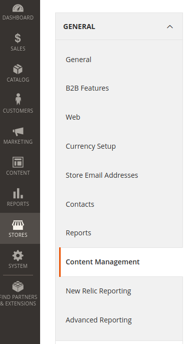
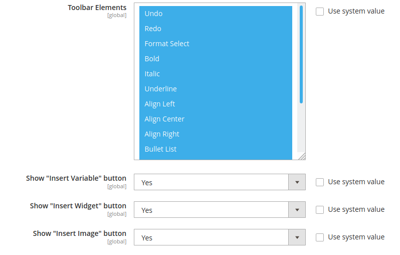
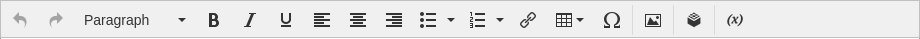

# IntegerNet_ConfigurableWysiwyg Magento 2 Module
<div align="center">

[![Latest Version on Packagist][ico-version]][link-packagist]
[![Software License][ico-license]](LICENSE.md)
![Supported Magento Versions][ico-compatibility]

[![Coverage Status][ico-scrutinizer]][link-scrutinizer]
[![Quality Score][ico-code-quality]][link-code-quality]
[![Maintainability][ico-maintainability]][link-maintainability]
</div>

---

Configure the Magento 2 WYSIWYG Editors: Remove buttons, adjust headings, ... 

## Requirements

- Magento 2.3.x or 2.4.x

## Installation

1. Install it into your Magento 2 project with composer:
    ```
    composer require integer-net/magento2-configurable-wysiwyg
    ```

2. Enable module
    ```
    bin/magento setup:upgrade
    ```

## Configuration

You can find all configuration settings for this module in Store -> Configuration -> General -> Content Management:



These are the new fields and their default settings:



### Toolbar Elements

This defines which icons will be available in the WYSIWYG editors. By default it looks like this:



If you deselect some of the entries, it can look as follows:


### Show "Insert Variable" button

This button is used to insert variable values into content, like the store name. It's not used very often so it's probably safe to disable that button.

### Show "Insert Widget" button

You only need that button if you are using Widgets (i.e. for inserting product lists, dynamic links or static blocks) in Magento CMS.

### Show "Insert Image" button

You might want to disable this button if you don't want to insert images directly into WYSIWYG fields.

## Usage

If you change anything on the configuration page and click "Save Config", the settings will be applied to all WYSIWYG fields from then on.

## Changelog

Please see [CHANGELOG](CHANGELOG.md) for more information on what has changed recently.

## Contributing

Please see [CONTRIBUTING](CONTRIBUTING.md) for details.

## Security

If you discover any security related issues, please email security@integer-net.de instead of using the issue tracker.

## Credits

- [Andreas von Studnitz][link-author]
- [All Contributors][link-contributors]

## License

The MIT License (MIT). Please see [License File](LICENSE) for more information.

[ico-version]: https://img.shields.io/packagist/v/integer-net/magento2-configurable-wysiwyg.svg?style=flat-square
[ico-license]: https://img.shields.io/badge/license-MIT-brightgreen.svg?style=flat-square
[ico-scrutinizer]: https://img.shields.io/scrutinizer/coverage/g/integer-net/magento2-configurable-wysiwyg?style=flat-square
[ico-code-quality]: https://img.shields.io/scrutinizer/g/integer-net/magento2-configurable-wysiwyg.svg?style=flat-square
[ico-maintainability]: https://img.shields.io/codeclimate/maintainability/integer-net/magento2-configurable-wysiwyg?style=flat-square
[ico-compatibility]: https://img.shields.io/badge/magento-2.3%20|%202.4-brightgreen.svg?logo=magento&longCache=true&style=flat-square

[link-packagist]: https://packagist.org/packages/integer-net/magento2-configurable-wysiwyg
[link-scrutinizer]: https://scrutinizer-ci.com/g/integer-net/magento2-configurable-wysiwyg/code-structure
[link-code-quality]: https://scrutinizer-ci.com/g/integer-net/magento2-configurable-wysiwyg
[link-maintainability]: https://codeclimate.com/github/integer-net/magento2-configurable-wysiwyg
[link-author]: https://github.com/integer-net
[link-contributors]: ../../contributors
